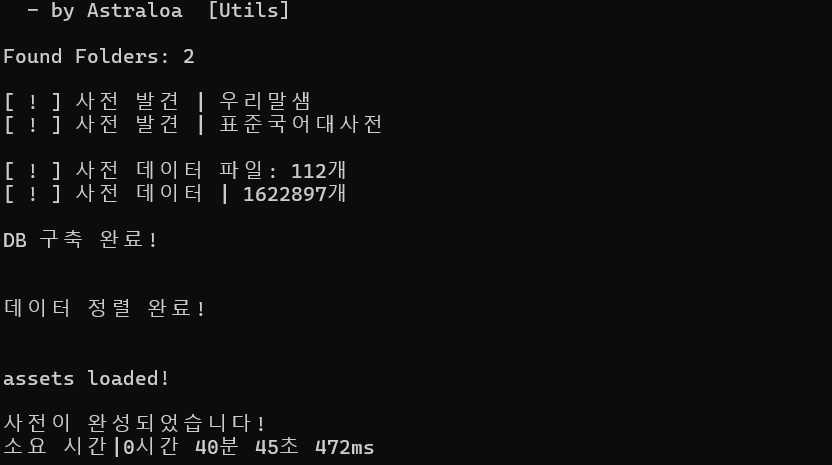

# korean-dict
> [국립국어원](https://www.korean.go.kr/) 사전 파서
>
> # Support Dicts
> [표준국어대사전](https://stdict.korean.go.kr/)
>
> [우리말샘](https://opendict.korean.go.kr/)
>
> # preview
> 총 소요 시간 | `0시간 40분 45초 472ms`
>
> `DB 파일 속성`
> 
> |dicts|info|
> |:-:|:-:|
> |word, mean, sort, type, prefix, suffix|build_time, data, creator|
> 
> |사전들 기존 용량|디비 용량|
> |:-:|:-:|
> |`2.43GB` (`2,615,860,503 bytes`)|`196MB` (`206,557,184 bytes`)|
>
> __약 12.664배 감소__
> 
> 
> 
> # How to use?
> 1. 사용할 사전들을 `전체 내려받기 > json 으로 내려받기` 로 내려받습니다.
> 2. 다운 받은 사전들의 압축을 해제합니다.
> 3. 해당 사전의 형식을 `${dict_name}_json/${file_name}.json` 꼴이 되게 정렬합니다.
> 4. 형식의 예시는 다음과 같습니다. `우리말샘_json/1413531_50000.json`
> 5. 해당 레포지스토리를 내려받은 후에 압축을 풉니다.
> 6. 국립국어원 폴더 안에 `index.js` 파일이 있는 위치에 해당 사전 데이터의 폴더들을 옮깁니다.
> 7. `node 국립국어원` 혹은 `node 국립국어원/index.js` 로 파일을 실행합니다.
> 8. 실행이 끝난 후 `index.js` 파일의 위치에 `dicts_${Date.now()}.db` 가 있으면 성공입니다.
>
> # Required node packages
> 1. `node:fs` (default)
> 2. `better-sqlite3` (npm)
  ```bash
npm i better-sqlite3 --force
  ```
